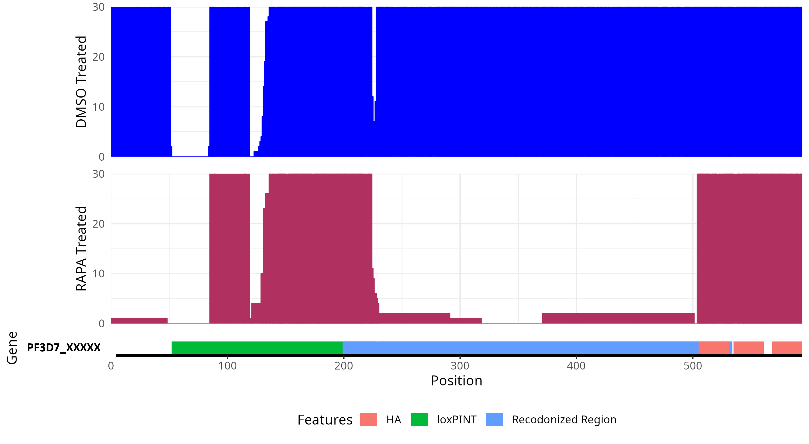

# plotRecod
Pipeline to plot coverage of recodonized genes from RNAseq data.

## Input required
**For Nextflow Pipeline**
1. Fasta file from SNAPGene software of the recodonized gene. Since the pipeline uses BWA which does not perform spliced alignment, users are expected to provide the recodonized fasta with exons only. But feel free to add other regions such as loxPint and UTRs.
2. (optional) A feature file from SNAPgene containing information about the regions and their corresponding information. This file is used for visualization purposes only and is modified and renamed when given along with the nextflow command. Users are encouraged to remove unnecessary regions like primers, exons, mRNA, genes, etc. which are redundant and span the same region. If not the pipeline tries to get rid of features having exact coordinates (start and end) and remove primer entries automatically. The `geneID.tsv` file so produced can be further modified before proceeding to the visualization step.

**For plotting coverage**
1. A `.csv` file containing the following fields:
Path1: Path of control sample mosdepth file i.e. `./results/03_bamStats`
File1: Name of the control sample mosdepth file i.e. `control.per-base.bed.gz`
Path2: Path of treatment sample mosdepth file i.e. `./results/03_bamStats`
File2: Path of treatment sample mosdepth file i.e.`treatment.per-base.bed.gz`
Cond: Defining the status of the sample. eg. `DMSO treated` and `RAPA treated`

See `plotsheet.csv` for example.

> Note: The row order and column names are not important but the column order must be preserved.
 

## Output
**For Nextflow Pipeline**
1. Adapter Trimmed fastq files.
2. Aligned and indexed bam files. The alignment folder also contains the deduplicated feature file that will be required for making a coverage plot. Users can add/delete rows from this file.
3. Alignment statistics. The mosdepth `per-base-coverage` file that is used by the R script to create coverage plots is produced as well.

**For plotting coverage**
1. A presentation containing your Control vs Treatment Coverage plot with features as shown below:



## Commands to run a pair of Control and Treatment Samples

#### Step1:
```bash
## If the control and treatment are named as EIAG13_S1_.......gz and EIAG13RAPA_S2......gz and you also want to generate the feature file for step2
nextflow run main.nf --input "data/EIAG13*_L001_R{1,2}_001.fastq.gz" --ref "resources/eiap13.fa" --feature "resources/eiap13.txt" --geneID="PF3D7_xxxxxxx" -w work4

#If you wish to generate feature TSV manually
nextflow run main.nf --input "data/EIAG9*_L001_R{1,2}_001.fastq.gz" --ref "resources/eiap9.fa" --geneID="PF3D7_xxxxxx" -w work2
```
#### Step2

```bash
## View help section
Rscript bin/plotCoverage.R -h

usage: bin/plotCoverage.R [-h] [-c CSV] [-w WTPREFIX] [-t TRTPREFIX]
                          [-x XCOVERAGE] [-p PNAME]

Produce Coverage Plot

options:
  -h, --help            show this help message and exit
  -c CSV, --csv CSV     Provide CSV file containing the path of mosdepth and
                        feature file
  -w WTPREFIX, --wtPrefix WTPREFIX
                        Prefix used to represent Wild Type samples
  -t TRTPREFIX, --trtPrefix TRTPREFIX
                        Prefix used to represent Treatment samples
  -x XCOVERAGE, --xCoverage XCOVERAGE
                        Coverage threshold for plots
  -p PNAME, --pname PNAME
                        Name of the presentation
```

```
## Plot coverage of all samples in a single attempt and get a presentation ready output
Rscript bin/plotCoverage.R -c plotsheet.csv -w "DMSO Treated" -t "RAPA Treated" -x 30 -p summary_plots
```
  
